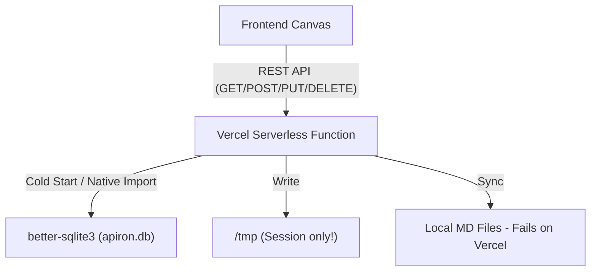
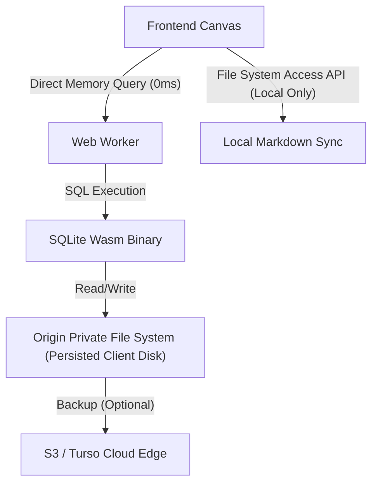

# Technical Feasibility Study: WebAssembly (Wasm) Migration for Apiron OS

This document evaluates the feasibility, benefits, trade-offs, and implementation paths of migrating Apiron OS from a server-side SQLite architecture (hosted on Vercel Serverless Functions) to a **client-side WebAssembly (Wasm)** architecture.

---

## 1. Executive Summary

- **Is it possible?** **Yes, 100% feasible.**
- **Does it solve Vercel server lag?** **Yes.** It completely eliminates the 1–5 second Vercel cold-start latency and the ~100–300ms network round-trip delay for mutations (creating, moving, aligning, and deleting nodes).
- **Core Recommendation**: Transition to a **Local-First Architecture** utilizing the official `@sqlite.org/sqlite-wasm` package running in a Web Worker, backed by the **Origin Private File System (OPFS)** for persistent browser storage.

---

## 2. Current Architecture vs. Wasm Architecture

### Current Server-Side Model

- **The Bottleneck**: Every single coordinate change, rating edit, note creation, or layout alignment sends a network request. Because Vercel serverless functions spin down after periods of inactivity, the user experiences major "cold-start" delays, followed by network round-trip overhead for every dragging/saving action.

### Proposed Wasm Client-Side Model

- **The Solution**: The database engine runs directly in the user's browser compiled to WebAssembly. The Vercel server is reduced to a static CDN that delivers the HTML, CSS, JS, and Wasm files once. All database operations execute instantly in client memory.

---

## 3. How Wasm Eliminates Vercel Lag

1. **Zero Cold Starts**: Since API routes are no longer queried for canvas interactions, there are no serverless functions to spin up.
2. **0ms Network Latency**: Saving a note, connecting nodes, or running a layout alignment operates directly on the browser's memory heap, reducing mutation latency to less than **1ms**.
3. **No Read-Only Filesystem Restrictions**: The browser's Origin Private File System (OPFS) is fully writeable, eliminating the need to copy database files to `/tmp` at startup.

---

## 4. Implementation Path

### Option A: Pure Client-Side SQLite Wasm (OPFS) — *Recommended*
Use the official `@sqlite.org/sqlite-wasm` build. It utilizes the browser's OPFS via a Web Worker to enable high-performance, concurrent database access.
*   **Storage**: Database state is persisted locally inside the browser's private sandbox.
*   **Git Syncing / Local files**: Since the browser cannot write to your project directory directly for security reasons, we can integrate the **File System Access API** (`window.showDirectoryPicker()`). When running locally, the user can select their workspace folder, and the browser can write the markdown notes directly to the local git folder.

### Option B: libSQL / Turso Edge Syncing
If cross-device sync is required, use **libSQL Wasm** (the SQLite fork by Turso).
*   **How it works**: The client writes to a local SQLite Wasm instance. In the background, libSQL synchronizes changes with a remote Turso database over WebSocket.
*   **Benefit**: Instant local mutations combined with robust, seamless cloud backup.

---

## 5. Technical Trade-offs & Challenges

| Challenge | Impact | Mitigation |
| :--- | :--- | :--- |
| **Initial Loading Time** | The SQLite Wasm binary (~1MB) must be downloaded on first visit. | Use service workers to cache the Wasm binary locally for instant subsequent loads. |
| **Data Persistence** | Clearing browser storage or cookies could potentially erase the local OPFS database. | 1. Implement automatic DB export/backup to local file or cloud S3 storage. 2. Request persistent storage permission from the browser. |
| **Cross-Device Sync** | A local-first DB is bound to the device's browser. | Integrate Turso syncing or a simple backup JSON upload/download feature. |

---

## 6. Migration Feasibility Verdict

- **Feasibility Rating**: **9/10**
- **Effort Required**: **Medium (3–5 days of developer effort)**.
  - The UI code (`Canvas.jsx`) is already separated from the database layer and relies on state arrays (`notes`, `books`, etc.).
  - Migration requires replacing backend API fetch calls in `Canvas.jsx` (e.g. `/api/notes`) with calls to a local Wasm SQLite wrapper/worker.
  - CRUD operations inside API routes will be ported to client-side SQL statements.

---
